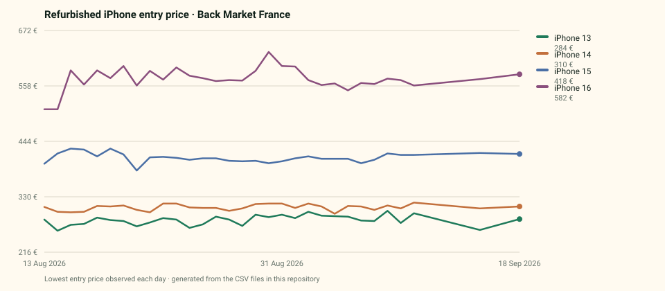

# Refurbished iPhone prices — an open, dated dataset

[](LICENSE-DATA)
[](.github/workflows/update-dataset.yml)
[](#coverage)

The entry price of refurbished iPhones, recorded twice a day on Back Market's
French, American, German and Spanish storefronts, kept as a time series and
published here as plain CSV.



## Why this exists

Marketplace prices are visible today and gone tomorrow. Nobody publishes what a
refurbished iPhone actually cost on a given date, so the question that matters
to a buyer — *is this a good price, or just a price?* — has no public answer.

This repository is the raw material behind [priceradar.live](https://www.priceradar.live),
released so that anyone can check the figures, disagree with them, or use them
for something else entirely.

Every observation is committed on the day it was taken. The git history is
therefore an audit trail: it is not possible to quietly revise a past price
here, and you can verify any figure against the commit that introduced it.

## Coverage

| Market | Storefront | Currency | Models | Observations | First observation |
| --- | --- | --- | --- | --- | --- |
| `FR` | Back Market France | EUR | 15 | 1 065 | 13 August 2026 |
| `US` | Back Market US | USD | 15 | 315 | 18 August 2026 |
| `DE` | Back Market Deutschland | EUR | 16 | 90 | 30 August 2026 |
| `ES` | Back Market España | EUR | 15 | 75 | 3 September 2026 |

Live counts are in [`stats.json`](stats.json), regenerated with every update.

**The series is young.** Collection started on 13 August 2026 for France and
later for the other markets. That is enough to compare a price with the past few
weeks; it is not enough to describe a yearly depreciation curve, and this
dataset should not be used to claim one. It grows by two observations per model
per day.

## Files

```
latest.csv              most recent observation of each model, per market
data/<market>/<YYYY-MM>.csv    every observation, one file per market per month
stats.json              coverage summary, regenerated on each update
schema.json             field definitions (Frictionless Table Schema)
datapackage.json        machine-readable descriptor of the whole dataset
```

Past months never change, so a monthly split keeps the diffs small and the files
openable in a browser.

### Schema

Every CSV has the same seven columns.

| Column | Type | Description |
| --- | --- | --- |
| `observed_at` | datetime | When the price was read, ISO 8601, UTC, second precision |
| `market` | string | `FR`, `US`, `DE` or `ES` |
| `model_id` | string | Stable identifier, comparable across markets (`iphone-16-pro`) |
| `model` | string | Model name as displayed by the source |
| `price` | number | Entry price at that moment, two decimals |
| `currency` | string | ISO 4217, always the market's own currency |
| `reference_new_price` | number | New price for the same model as displayed by the source; empty when absent |

```csv
observed_at,market,model_id,model,price,currency,reference_new_price
2026-09-06T07:00:03Z,FR,iphone-16,iPhone 16,564.00,EUR,969.00
```

## Quick start

```python
import pandas as pd

frames = pd.read_csv("https://raw.githubusercontent.com/OWNER/priceradar-dataset/main/latest.csv")
print(frames.sort_values("price").head())
```

Every observation for one market:

```python
import glob, pandas as pd

fr = pd.concat(pd.read_csv(path) for path in sorted(glob.glob("data/fr/*.csv")))
fr["observed_at"] = pd.to_datetime(fr["observed_at"])

# Lowest entry price seen for each model
print(fr.groupby("model")["price"].min().sort_values())
```

With DuckDB, straight from the files:

```sql
SELECT model, min(price) AS lowest, max(price) AS highest
FROM 'data/fr/*.csv'
GROUP BY model
ORDER BY lowest;
```

## What the numbers mean

`price` is the **entry price**: the cheapest configuration on offer for that
model at that moment — usually the smallest storage and the most marked
cosmetic grade. It is not the price of one specific unit, and the amount at
checkout can be higher.

That single definition is what makes the series comparable over time. The full
reasoning, including what is measured and what is deliberately not, is in
[METHODOLOGY.md](METHODOLOGY.md).

## Limitations

Read these before drawing a conclusion.

- **Entry price only.** Storage, cosmetic grade and battery health change the
  real price. This dataset cannot tell you what a 256 GB unit in excellent
  condition costs.
- **Two readings a day.** A move that happens and reverses between two readings
  is invisible here. The data shows what was observed, not everything that
  happened.
- **A rise is not always a rise.** Marketplaces show the cheapest offer
  available. When the seller holding it runs out of stock, the displayed price
  jumps to the next cheapest without anyone changing a price.
- **Markets are separate.** Prices are never converted between currencies. A
  French and an American figure describe two different markets and are not
  comparable as amounts.
- **Short history.** See the note under [Coverage](#coverage).

## What is not included, and why

The dataset publishes what was *observed over time* — a series that did not
exist before it was recorded. It deliberately leaves out material belonging to
the source: product URLs, seller identity, images, ratings and review counts.

There are no personal data of any kind, and nothing here comes from a page
requiring authentication.

## How the data is collected

A small worker reads the publicly listed price of a fixed catalogue of models,
once or twice a day, at a deliberately low request rate. It follows
`robots.txt`, identifies itself, never authenticates, never simulates a purchase
path, and stops on repeated abnormal responses.

Details and rationale: [METHODOLOGY.md](METHODOLOGY.md).

## Licence and citation

The data is published under [Creative Commons Attribution 4.0](LICENSE-DATA).
You may use it, including commercially, provided you credit the source.

> Price Radar — *Refurbished iPhone prices dataset*, observations from
> 13 August 2026 onwards. https://www.priceradar.live

GitHub's "Cite this repository" button uses [CITATION.cff](CITATION.cff).

## Corrections

If a figure looks wrong, open an issue with the market, the model and the date.
Observations are checked against the stored series and corrected when they are
mistaken — with the correction visible in the history, like everything else.

## Related

The same observations, charted, with per-model history and free price alerts:
**[priceradar.live](https://www.priceradar.live)**.

Price Radar is an independent price-tracking project. It is not operated by
Back Market, is not affiliated with any brand mentioned, and earns no commission
on purchases. Apple, iPhone and Back Market are trademarks of their respective
owners, named here only to identify the products and the source observed.
